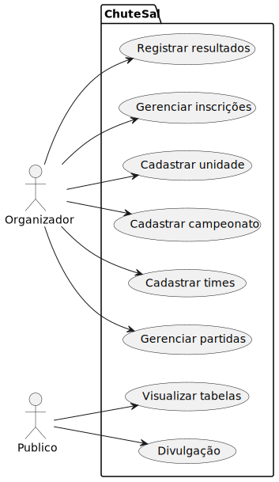
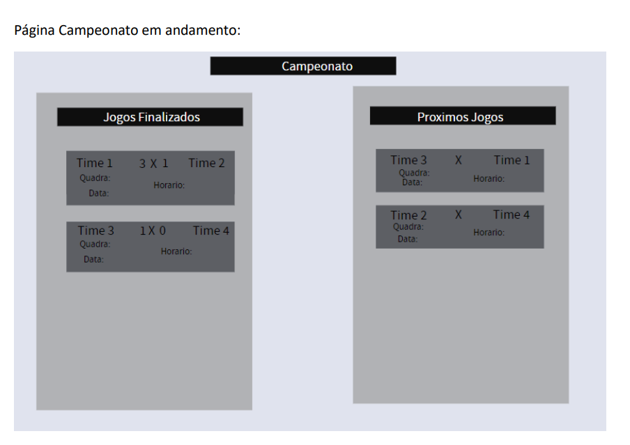
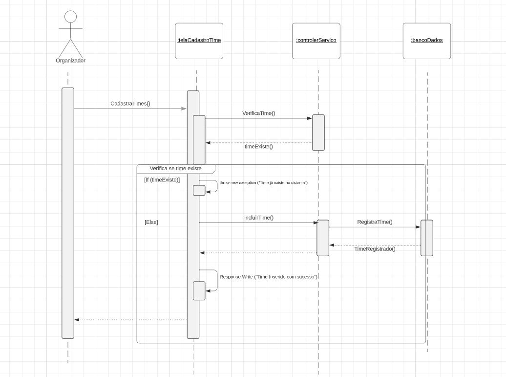

# Documento de especificação

## Casos de uso

1. Cadastrar Unidade (UC1):
O Organizador pode cadastrar informações sobre uma nova unidade, incluindo nome e endereço. Isso é necessário para a gestão dos campeonatos.

2. Cadastrar Campeonato (UC2):
O Organizador pode cadastrar um novo campeonato, fornecendo detalhes como nome, unidade, quadra, período de inscrição e datas dos jogos. Isso permite a organização de competições entre times.

3. Cadastrar Times (UC3):
O Organizador pode cadastrar times para um campeonato específico, inserindo informações como nome e posição. Isso é necessário para compilar as tabelas de classificação.

4. Gerenciar Partidas (UC4):
O Organizador tem a capacidade de gerenciar as partidas, incluindo a programação de datas e horários, atribuindo times a cada partida e especificando a rodada. Isso ajuda a estruturar os jogos do campeonato.

5. Registrar Resultados (UC5):
O Organizador pode registrar os resultados das partidas, informando os placares de cada time. Isso permite o acompanhamento das pontuações e classificações ao longo do campeonato.

6. Divulgação (UC6):
O Público em geral tem a capacidade de visualizar informações divulgadas sobre o campeonato, como datas, horários das partidas e resultados. Isso permite que as pessoas acompanhem os eventos.

7. Visualizar Tabelas (UC7):
O Público em geral tem a capacidade de visualizar as tabelas de classificação, que mostram a posição de cada time no campeonato com base em seus resultados. Isso ajuda a entender o desempenho dos times.

8. Gerenciar Inscrições (UC8):
O Organizador pode gerenciar as inscrições dos times nos campeonatos, verificando e controlando quem está registrado para participar. Isso é importante para garantir a organização adequada dos jogos.

## Protótipos da interface com o usuário
[Protótipo](./pdf/Wireframes%20ChuteSal.pdf)  

## Modelo de domínio

## Arquitetura
- Dados serão armazenados em um banco de dados relacional SQLite, operado através de um ORM.
- Back-end será em Python 3.11 usando Django como ORM e Django Rest Framework para expor os dados via API REST.
- Front-end web será em javascript, utilizando o framework Vue 3 e a biblioteca Vuetify para adequar os padrões de design ao Material Design do Google.
- Back-end será deployado utilizando Docker e docker-compose.
- Website será hospedado em um EC2 da AWS, com o back-end, o front-end e o banco de dados rodando na mesma máquina visando a redução de custos.
- nginx será usado para a realização de reverse proxy.
## Diagrama de classes

## Diagrama de sequência
