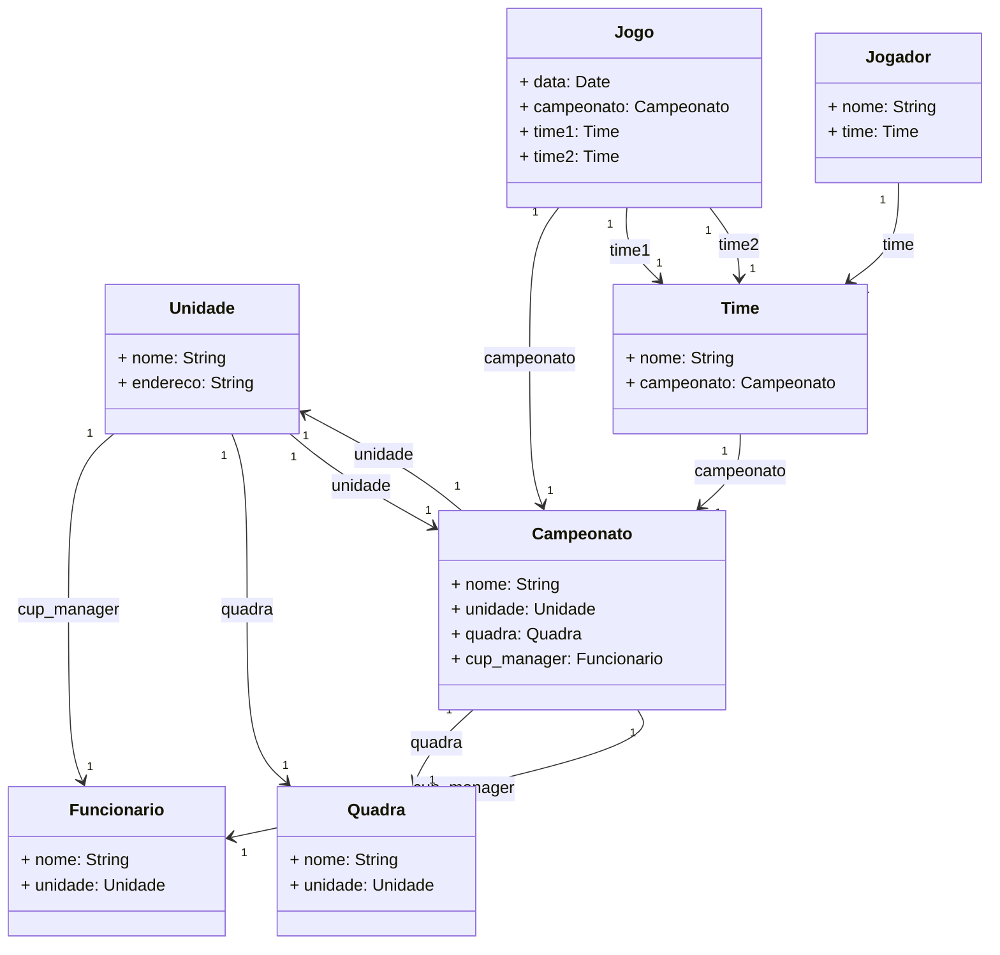

```mermaid
classDiagram
  class Unidade {
    + nome: String
    + endereco: String
  }

  class Funcionario {
    + nome: String
    + unidade: Unidade
  }

  class Quadra {
    + nome: String
    + unidade: Unidade
  }

  class Campeonato {
    + nome: String
    + unidade: Unidade
    + quadra: Quadra
    + cup_manager: Funcionario
  }

  class Time {
    + nome: String
    + campeonato: Campeonato
  }

  class Jogo {
    + data: Date
    + campeonato: Campeonato
    + time1: Time
    + time2: Time
  }

  class Jogador {
    + nome: String
    + time: Time
  }

  Unidade "1" --> "1" Funcionario: cup_manager
  Unidade "1" --> "1" Quadra: quadra
  Unidade "1" --> "1" Campeonato: unidade
  Campeonato "1" --> "1" Quadra: quadra
  Campeonato "1" --> "1" Funcionario: cup_manager
  Campeonato "1" --> "1" Unidade: unidade
  Time "1" --> "1" Campeonato: campeonato
  Jogo "1" --> "1" Campeonato: campeonato
  Jogo "1" --> "1" Time: time1
  Jogo "1" --> "1" Time: time2
  Jogador "1" --> "1" Time: time


```